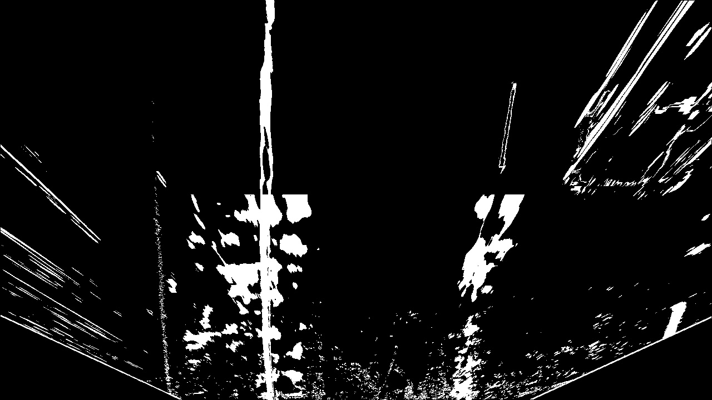
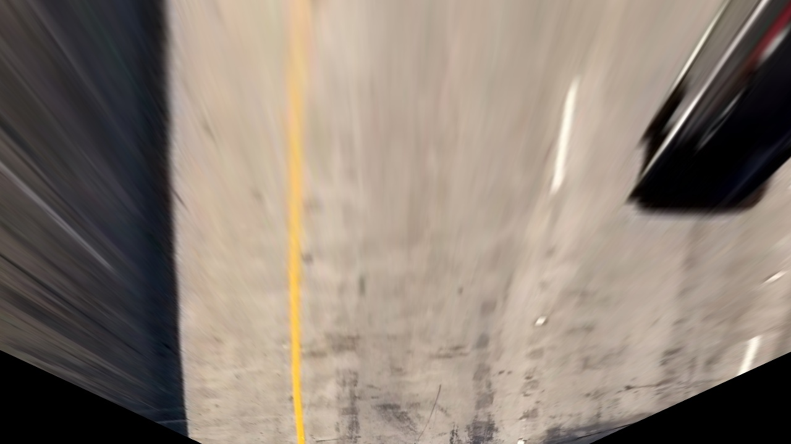
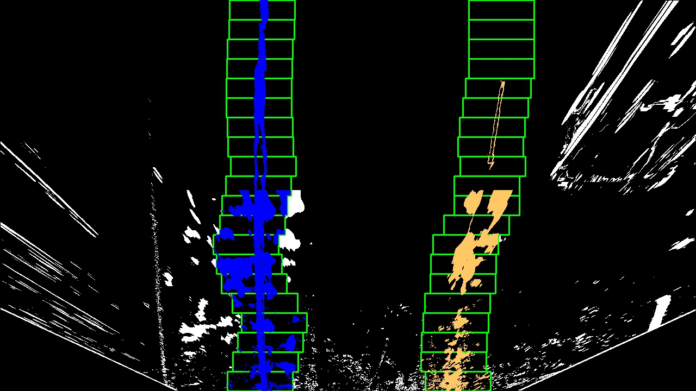
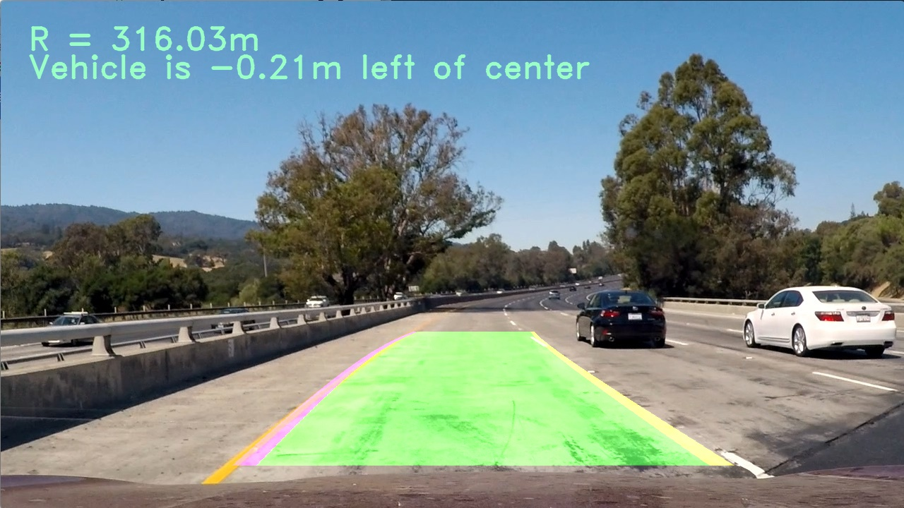

## Writeup
---

**Advanced Lane Finding Project**

The goals / steps of this project are the following:

* Compute the camera calibration matrix and distortion coefficients given a set of chessboard images.
* Apply a distortion correction to raw images.
* Use color transforms, gradients, etc., to create a thresholded binary image.
* Apply a perspective transform to rectify binary image ("birds-eye view").
* Detect lane pixels and fit to find the lane boundary.
* Determine the curvature of the lane and vehicle position with respect to center.
* Warp the detected lane boundaries back onto the original image.
* Output visual display of the lane boundaries and numerical estimation of lane curvature and vehicle position.

[//]: # (Image References)

[image1]: ./examples/undistort_output.png "Undistorted"
[image2]: ./test_images/test1.jpg "Road Transformed"
[image3]: ./examples/binary_combo_example.jpg "Binary Example"
[image4]: ./examples/warped_straight_lines.jpg "Warp Example"
[image5]: ./examples/color_fit_lines.jpg "Fit Visual"
[image6]: ./examples/example_output.jpg "Output"
[video1]: ./project_video.mp4 "Video"

---
### Camera Calibration
Note: The majority of the code in this project is taken from the lectures.  
This is done via the function `calibrate()` in helpers.py.

I start by preparing "object points", which will be the (x, y, z) coordinates of the chessboard corners in the world. Here I am assuming the chessboard is fixed on the (x, y) plane at z=0, such that the object points are the same for each calibration image.  Thus, `objp` is just a replicated array of coordinates, and `objpoints` will be appended with a copy of it every time I successfully detect all chessboard corners in a test image.  `imgpoints` will be appended with the (x, y) pixel position of each of the corners in the image plane with each successful chessboard detection.  

I then used the output `objpoints` and `imgpoints` to compute the camera calibration and distortion coefficients using the `cv2.calibrateCamera()` function.  I applied this distortion correction to the test image using the `cv2.undistort()` function and obtained this result: 

![alt text][image1]  

### Pipeline (single images)
To explain how the pipline works, we will walk through it step by step by testing on the image: test1.jpg in the test_image folder. This is one of the hardest images to work on, due to the color change on the road.

#### 1. Correcting distortion.

To demonstrate this step, I will describe how I apply the distortion correction to one of the test images like this one:
![alt text][image2]  
The undistorted image becomes:
  

#### 2. Color and gradient thresholding.

I used a combination of color and gradient thresholds to generate a binary image using the function `apply_thresholds(image)`, which consistes of two color thresholding functions combined with four gradient thresholding functions. We found it very useful to use the L layer from Lab color space. We also used the S layer from the HLS color space. These two were combined with x-gradient, y-gradient, magnitue gradient, and directions gradient binary images. The combination is done in at line 165 in helpers.py: 
```python
combined[((gradx == 1) & (grady == 1)) | ((mag_binary == 1) & (dir_binary == 1)) | ((S_bin == 1) | (L_bin == 1))] = 1
```  
The resulting output is:  

  


#### 3. Perspective transform.

To do perspective tranform, we define src and dst as follows (line 32 and 33).
```python
src = np.float32(
    [[(img_size[0] / 2) - 55, img_size[1] / 2 + 100],
    [((img_size[0] / 6) - 10), img_size[1]],
    [(img_size[0] * 5 / 6) + 60, img_size[1]],
    [(img_size[0] / 2 + 55), img_size[1] / 2 + 100]])
dst = np.float32(
    [[(img_size[0] / 4), 0],
    [(img_size[0] / 4), img_size[1]],
    [(img_size[0] * 3 / 4), img_size[1]],
    [(img_size[0] * 3 / 4), 0]])
```

This resulted in the following source and destination points:

| Source        | Destination   | 
|:-------------:|:-------------:| 
| 585, 460      | 320, 0        | 
| 203, 720      | 320, 720      |
| 1127, 720     | 960, 720      |
| 695, 460      | 960, 0        |

 Since the calibration is called before the definition of the pipeline, mtx and dist are automatically passed to the function (very cool python trick).  We find the prespective transform matrix by calling: `M = cv2.getPerspectiveTransform(src, dst)`. We also save in inverse tranform matrix `Minv = cv2.getPerspectiveTransform(dst, src)`. Then we preform the prespective tranform (line 37 in test.py).
The result is:  
  

#### 4. Cruve fitting for the left and right sides of the lane.
This part is done in the function `sliding_window` defined in trainer.py (defined within the pipeline). The basic idea is to start from the bottom of the image with two windows (of fixed sizes). The left and right lane lines should be at the center of these windows. To do so, we start by finding the peaks from a historgram of pixel densities. These peaks tell us where the lanes start. After defining the starts, we fit the pixels in each window into a second order polynomial using `polyfit`. Then we proceed up the image by sliding the windows. The result of this process is visualized in this image:
  

#### 5. Radius of curvature and car position relative to the center of the lane.
We used this [tutorial](https://www.intmath.com/applications-differentiation/8-radius-curvature.php) to calculate the radius of curvature of the lane. 
Calculate the radius using the following formula:
```python
left_curverad = ((1 + (2*left_fit_cr[0]*y_eval*ym_per_pix + left_fit_cr[1])**2)**1.5) / np.absolute(2*left_fit_cr[0])
```
The same is done for the right lane (lines 218 and 219 in test.py). The position is found through lines 223 to 228. Basically, we find the x-intercept for the left and right sides of the lane. Then we find the distance from the center of the image (car position) to the midpoint of the two intercepts (middle of the lane).

#### 6. Final image result after drawing lanes and data.

I implemented this step in lines # through # in my code in `yet_another_file.py` in the function `map_lane()`.  Here is an example of my result on a test image:

  

---

### Pipeline (video)

Here's a [youtube link to my video result](https://youtu.be/iNPjBX5xpRw). A copy of the video is also saved in this repository (project_video_labeled.mp4)
---

### Discussion

#### 1. Briefly discuss any problems / issues you faced in your implementation of this project.  Where will your pipeline likely fail?  What could you do to make it more robust?

The hardest part of this project was to find the correct thresholds for different colors from different color spaces, especially in the example image shown here. Even after extensive tuning of thresholds, the pipeline performs differently on the challenge videos. It is difficult to generalize only using thresholding features. It is worth investigating if we can utilize deep learning approaches to automatically find the relevant features and label lines (End-to-End).  
This pipeline can be particulary effective in controlled environments such as factories, where the relevant features don't change over time.
